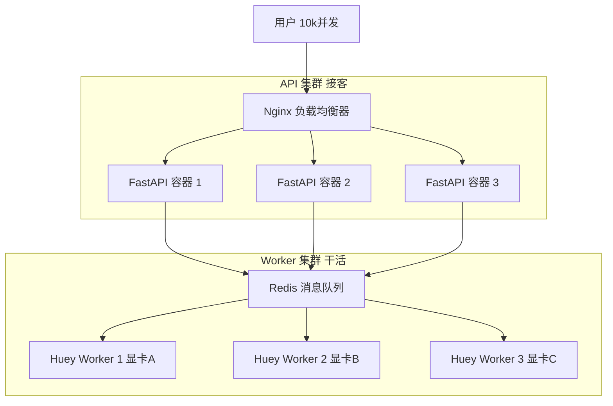

# 面试题：如何处理高并发？

这是一个经典的系统设计问题。在 Python Web 开发（尤其是 AI 应用）中，标准答案通常包含三个维度的“组合拳”：

## 1. 前端/接入层：异步非阻塞 (Async/Await)
**关键词**：`FastAPI`, `uvicorn`, `epoll`, `IO密集型`

*   **作用**：解决“连接数”问题。
*   **场景**：当有 10,000 个用户同时发起请求，但每个请求都在等待（等数据库查询、等 OpenAI 返回）。
*   **原理**：
    *   传统同步框架（Flask/Django）一个线程只能处理一个请求，线程池耗尽就卡死。
    *   异步框架（FastAPI）利用 Event Loop，一个线程就能挂起成千上万个等待中的请求，吞吐量极高。
*   **局限**：只能解决 IO 等待，解决不了 CPU 计算（比如你的 Whisper 模型推理）。如果主线程去算 1+1=2 算了一万次，整个服务还是会卡死。

## 2. 后端/逻辑层：任务队列 (Task Queue)
**关键词**：`Celery`, `Huey`, `RabbitMQ`, `Redis`, `削峰填谷`, `解耦`

*   **作用**：解决“耗时任务”和“流量洪峰”问题。
*   **场景**：
    *   **耗时任务**：Whisper 转录需要 30秒，不能让 HTTP 连接等这么久。
    *   **流量洪峰**：突然来了 1000 个转录请求，但你只有 4 张显卡。
*   **原理**：
    *   **生产者 (API)**：只负责收单，把任务 ID 扔进队列（Redis），耗时 1ms，立马返回。
    *   **消费者 (Worker)**：根据自己的能力（比如设置 `workers=4`），慢慢从队列里取任务处理。
*   **价值**：保护后端不被冲垮。即使请求堆积在 Redis 里，服务依然能响应新用户的“提交”请求。

## 3. 基础设施层：水平扩展 (Horizontal Scaling)
**关键词**：`Docker`, `K8s`, `Load Balancer (Nginx)`

*   **作用**：解决“单机瓶颈”问题。
*   **原理**：
    *   当一台机器的 CPU/内存/显存 跑满了，Huey 队列也堆积了。
    *   加机器！启动 10 个 Worker 容器，同时消费同一个 Redis 队列。
    *   Nginx 把 HTTP 请求分发到 10 个 API 容器。

---

## 总结话术

> “处理高并发需要分层治理：
> 1.  **接入层**使用 **FastAPI (Async)** 处理海量并发连接，非阻塞 I/O 保证高吞吐。
> 2.  **业务层**剥离耗时任务（如 AI 推理、发邮件），使用 **Huey/Celery + Redis** 进行异步处理，实现削峰填谷。
> 3.  **架构层**通过 **Docker/K8s** 进行水平扩展，根据负载动态增减 Worker 节点。”

## 4. 架构图解 (The Big Picture)

这就是企业级架构的最终形态：

**核心魔法**：
*   **API 随便加**：只要 Nginx 改个配置，API 节点可以从 3 个变成 30 个。
*   **Worker 随便加**：Worker 甚至不需要知道 API 的存在，它们只盯着 Redis 看。只要 Redis 里有任务，谁抢到谁做。
*   **Redis 是中心**：它是连接“接客区”和“后厨”的唯一窗口。
